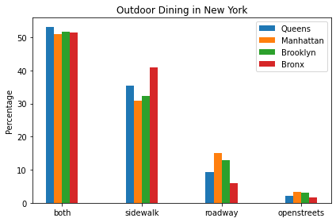

# Jackson Heights
## HC6 Highlighted Map:

## Basic Demographics & Statistics:
Zipcode: 11372

Jackson Heights, Queens, 11372, is a neighborhood containing 62,854 individuals as of 2019. 57.5% are Hispanic or Latino, 20.8% are Asian Alone, and 17.6% are White Alone. 59.7% of residents are foreign born. With this diversity comes a variety of cuisine and culture in the area in the form of immigrant-owned businesses. Jackson Heights is also one of the densest neighborhoods in Queens, with 84,844 people per square mile. The image above depicts both the dense population of the area and the variety of accessible eateries in the form of various cafes and restaurants. The median household income is $60,659, and 10.9% of families live below the poverty line. This information is pertinent to understanding what restaurants may be more or less accessible or popular to the residents of the neighborhood. More expensive restaurants are probably visited less frequently than places like Starbucks or local cafes.

## Summary of Observations for HC3
In order to determine how each of our Queens neighborhoods ranked in terms of desirability for outdoor dining, we compared each one using the following desirable qualities: walk score, transit score, and income. Walk Score measures how readily the residents of a neighborhood can access the restaurants. People walking around the neighborhood could spot the restaurants and decide to stay and eat. Transit Score measures how readily consumers outside the neighborhood can access the restaurants. People need to be able to access the restaurants easily if they hear about them through advertisements. Income  is used to determine the cost of living. This then indicates more opportunities for restaurants to operate and be supported. We first ranked each neighborhood by a criteria and awarded 1 to 5 points (5 being the best and 1 being the worst). Then we totaled the points to determine a final ranking. For all metrics, walk score, transit score and median income, the higher the number is, the more points each neighborhood received. In terms of desirability of outdoor dining, our metrics indicate the following for our respective neighborhoods in Queens (from best to worst): Ridgewood, Jackson Heights, Astoria, Maspeth, Flushing. Ridgewood has the best balance of walkability, train access, and income to create an environment ideal for people to start restaurants that have outdoor dining while being easily accessible to people in and out of the area.

## Summary of HC7 and HC8
#Plot 1:

This bar graph compares each borough (Queens, Manhattan, Brooklyn, and the Bronx) and their percentages of sidewalks, roadways, both, and open streets. Based on the percentages, all four boroughs prefer sidewalks to roadways. Within the analyzed boroughs, the average sidewalk areas are greater than all their average roadway areas. Plot #2 further supports the idea synthesized from Plot #1 that Queens has a stronger preference for sidewalks when compared to the boroughs of Brooklyn and Manhattan. However, when compared to the Bronx, Queens has a weaker preference than the Bronx. 

#Plot 2:

The pie chart analyzes the number (in percentages) of sidewalks, roadways, both, and open streets within the borough of Queens. The purpose of this pie chart is to give a numerical representation of whether sidewalks or roadways are more common for outdoor dinings in Queens. Overall, the number of sidewalks is greater than the number of roadways. Though Plot #1 does not depict the ratio between average sidewalk area and average roadway area, Plot #2 does. 

#Plot 3:

This bar graph compares each of our neighborhoods in Queens. This is a comparative bar plot with sidewalk average area in the blue and roadway average area in the orange. There is a clear difference between sidewalk and roadway areas. Plot #3 also supports the idea from Plot #1 and Plot #2 that Queens has a stronger preference for sidewalks, even within 5 of neighborhoods. This difference may be indicative of the space available for outdoor dining. More average space on the sidewalks reflect the higher amounts of sidewalk outdoor dining in Queens compared to the roadway outdoor dining as seen on Plot #2. 

#Plot 4:

In the neighborhood of Jackson Heights, the bar graph shows that the average sidewalk area is greater than the average roadway area. 

#Plot 5:

Based on the bar graph, the neighborhood of Jackson Heights prefers sidewalks compared to roadways for seating for outdoor dining.  

## Map from HC9
<dl>
  <iframe src="JSMap.html" width="600" height="400" frameborder="0" frameborder="0" marginwidth="0" marginheight="0" allowfullscreen></iframe>
</dl>
